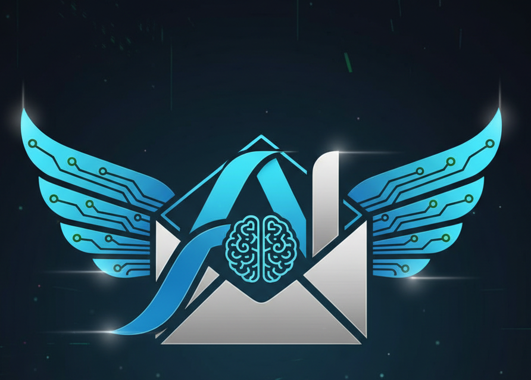

# Kaine - AI Email Assistant



**Smart AI-powered email management and automation**

## Overview

Kaine is an intelligent email assistant that helps you compose, draft, and manage emails with the power of AI. Built with modern web technologies, Kaine streamlines your email workflow by generating contextually relevant drafts, suggesting improvements, and automating repetitive email tasks.

## Features

- 🤖 **AI-Powered Email Drafting** - Generate professional email drafts instantly
- ✨ **Smart Suggestions** - Get AI-powered improvements for your emails
- 📧 **Email Management** - Organize and track your emails efficiently
- 🔐 **Secure Authentication** - Built with Supabase for secure user management
- 📊 **Analytics Dashboard** - Track your email productivity and time saved
- 🎨 **Modern UI** - Clean, intuitive interface built with shadcn/ui

## Tech Stack

- **Framework:** Next.js 16 (App Router with Turbopack)
- **Language:** TypeScript
- **Styling:** Tailwind CSS 4
- **UI Components:** shadcn/ui (Radix UI primitives)
- **Authentication:** Supabase Auth
- **Database:** Supabase (PostgreSQL)
- **AI:** Anthropic Claude Code API
- **Deployment:** Vercel

## Development Process

### Initial Setup
1. Started with an idea of why waste time replying to this email why not make a automation to this so i rapidly prototype the UI and core components
2. Generated the base project structure with Next.js 16 and shadcn/ui
3. Designed the landing page with modern animations and interactive elements

### Backend Integration
1. Integrated Supabase for authentication and database
2. Set up user authentication flows (signup/login)
3. Created database schema for emails, drafts, and analytics

### AI Implementation
1. Integrated Anthropic's Claude API for email generation
2. Built AI suggestion panel for real-time email improvements
3. Implemented context-aware drafting based on email subject and body

### Deployment & Configuration
1. Configured Next.js 16 with proper middleware → proxy migration
2. Set up Vercel deployment with automatic GitHub sync
3. Resolved Suspense boundary issues for client-side rendering
4. Optimized build configuration and removed node_modules from git

### Final Touches
1. Added custom branding with Kaine logo and metadata
2. Implemented responsive design for mobile and desktop
3. Set up analytics tracking for user engagement

## Getting Started

### Prerequisites
- Node.js 18+ 
- npm or pnpm
- Supabase account
- Anthropic API key

### Installation

1. Clone the repository:
```bash
git clone https://github.com/EunjiTan/Kaine.git
cd Kaine
```

2. Install dependencies:
```bash
npm install
```

3. Set up environment variables:
Create a `.env.local` file with:
```env
NEXT_PUBLIC_SUPABASE_URL=your_supabase_url
NEXT_PUBLIC_SUPABASE_ANON_KEY=your_supabase_anon_key
ANTHROPIC_API_KEY=your_anthropic_api_key
```

4. Run the development server:
```bash
npm run dev
```

5. Open [http://localhost:3000](http://localhost:3000)

## Deployment

This project is deployed on Vercel and automatically syncs with the GitHub repository.

**Live URL:** [https://kainee.vercel.app]

## Project Structure

```
Kaine/
├── app/                    # Next.js app router pages
│   ├── auth/              # Authentication pages
│   ├── protected/         # Protected routes (inbox, compose)
│   ├── api/               # API routes
│   └── layout.tsx         # Root layout
├── components/            # React components
│   ├── ui/               # shadcn/ui components
│   ├── auth/             # Auth components
│   └── email/            # Email-specific components
├── lib/                   # Utility functions
│   └── supabase/         # Supabase client & middleware
├── public/               # Static assets
└── proxy.ts              # Next.js proxy (middleware)
```

## Key Features Implementation

### AI Email Generation
- Uses Claude API to generate contextually relevant email drafts
- Analyzes subject line and initial body text to create appropriate responses
- Supports multiple drafts with regeneration capability

### Email Management
- Real-time inbox synchronization
- Draft saving and editing
- Email analytics tracking

### Authentication
- Secure signup/login with Supabase
- Protected routes with middleware
- Session management

## Contributing

Contributions are welcome! Please feel free to submit a Pull Request.

## License

This project is licensed under the MIT License.

## Acknowledgments
- UI components from [shadcn/ui](https://ui.shadcn.com)
- Deployed on [Vercel](https://vercel.com)

---

Made with 💙 by [EunjiTan]